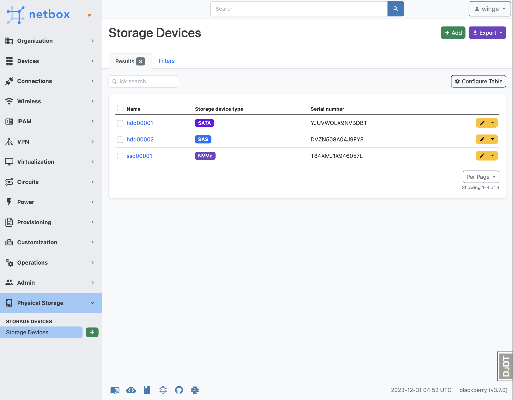
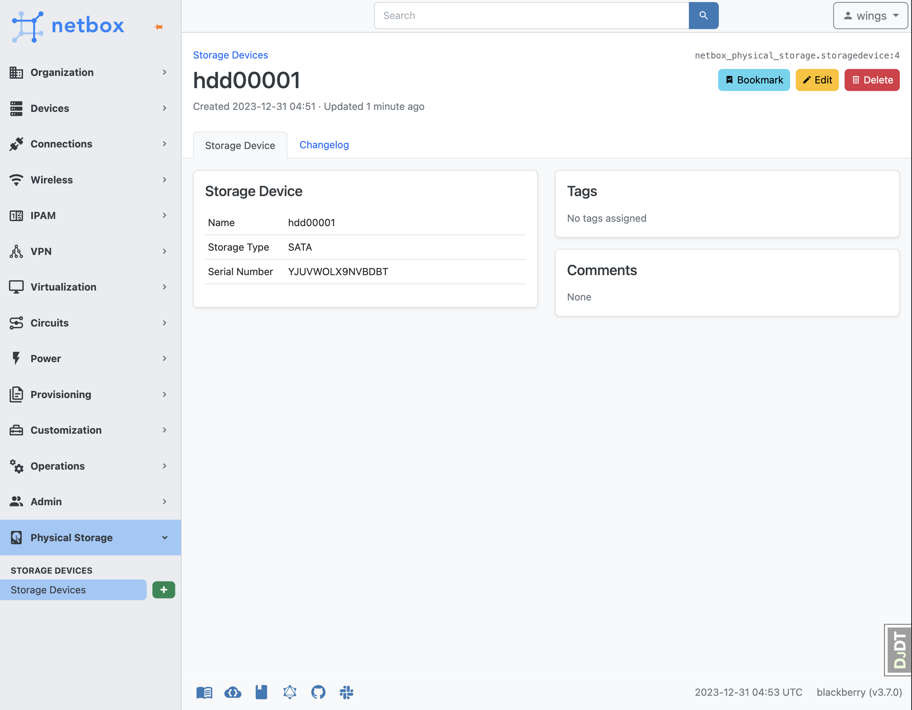
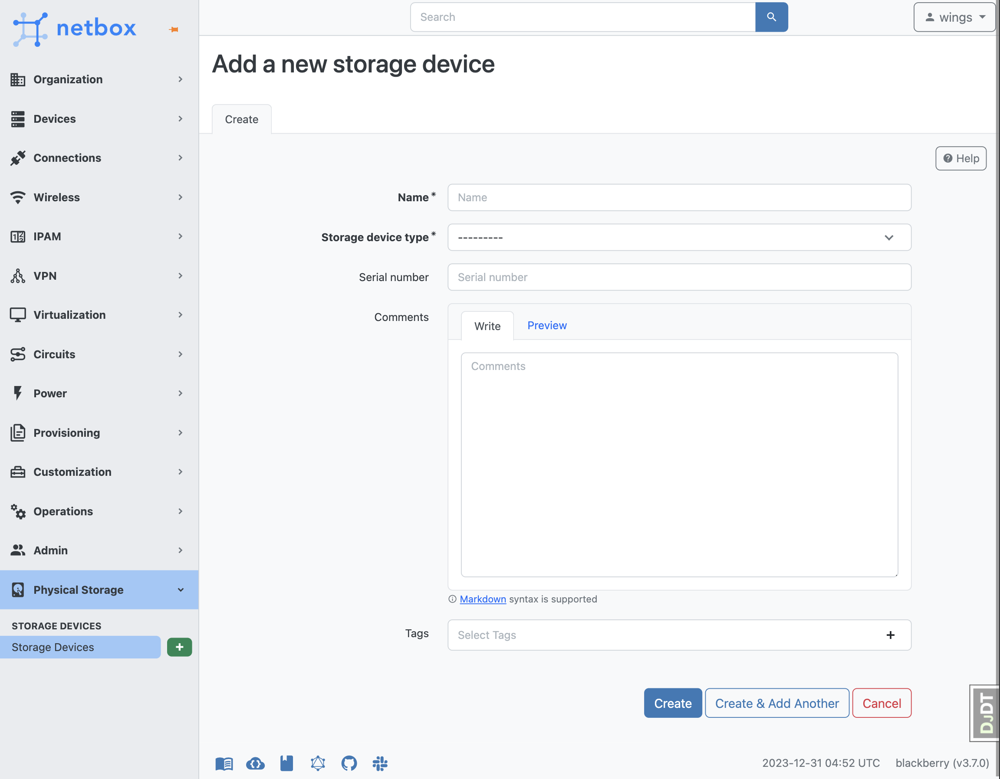

# NetBox Physical Storage Plugin

A [Netbox](https://github.com/netbox-community/netbox) plugin for management of physical storage devices such as hard drives, solid state disks and NVMes, and more.

***This is probably not that useful to you yet, and is changing rapidly! HERE BE DRAGONS, BE WARNED.***

## Features

This plugin currently allows you to do the following:

- Add, track and search storage devices by name + serial number + device type

## Future features

These are things I've been thinking about, but haven't implemented.

- Add and manage manufacturers + device models
    - DPWD information
    - Drive size
    - Drive class (enterprise, consumer, nearline, read-intensive, write-intensive)
    - Spindle technology (HMR, SMR, CMR)
- History tracking
    - Storage devices can live for a long time. It would be nice to be able to track changes to them over time.
      Where was this drive installed? In which server? Which slot? When was it replaced? What was it replaced with?
      Is it deprecated? Is it active? Is it dead? Was it RMA'd and replaced with a new drive?
- Extend the Devices model to allow you to add "Storage Bays" as as a component
- Enable you to then assign Storage Devices to those Storage Bays
- SAS cabling/topology (potentially with visualisation as a stretch goal?)
- ZFS, LVM and RAID modeling/tracking

## Credits

Based on the NetBox plugin tutorial by [jeremystretch](https://github.com/jeremystretch):

- [demo repository](https://github.com/netbox-community/netbox-plugin-demo)
- [tutorial](https://github.com/netbox-community/netbox-plugin-tutorial)

Portions taken from [Ryan Merolle](https://github.com/ryanmerolle/netbox-acls), thank you for the great examples!

## Contributing

This project is currently maintained by [Benjamin Arntzen](https://github.com/zorlin)

See the [CONTRIBUTING](CONTRIBUTING.md) for more information.

## Compatibility

Each Plugin version listed below has been tested with its corresponding NetBox version.

| NetBox version | Plugin version |
|:--------------:|:--------------:|
|      3.6       |     0.0.2      |
|      3.6       |     0.0.1      |

## Installing

For adding to a NetBox Docker setup see
[the general instructions for using netbox-docker with plugins](https://github.com/netbox-community/netbox-docker/wiki/Using-Netbox-Plugins).

You can install with pip:

```bash
pip install netbox-physical-storage
```

or by adding to your `local_requirements.txt` or `plugin_requirements.txt` (netbox-docker):

```bash
netbox-physical-storage
```

## Configuration

Enable the plugin in `/opt/netbox/netbox/netbox/configuration.py`,
 or if you use netbox-docker, your `/configuration/plugins.py` file :

```python
PLUGINS = [
    "netbox_physical-storage"
]

PLUGINS_CONFIG = {
    "netbox_physical-storage": {
        "top_level_menu": True # If set to True the plugin will add a top level menu item for the plugin. If set to False the plugin will add a menu item under the Plugins menu item.  Default is set to True.
    },
}
```

## Screenshots

Storage Devices - List View


Storage Devices - Individual View


Storage Devices - Adding a Device

